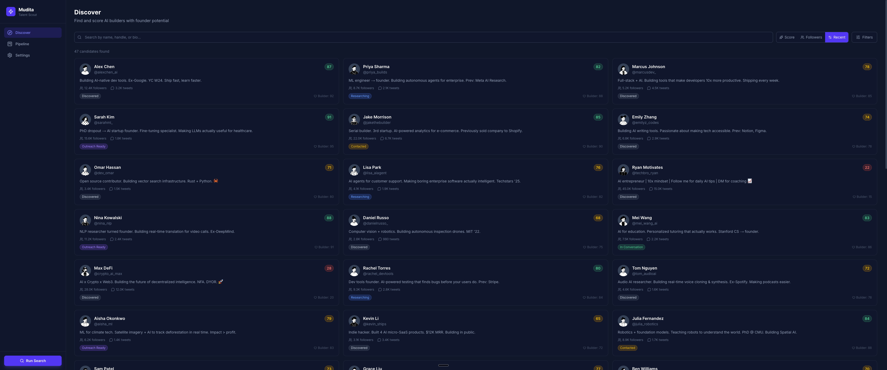

# Mudita Talent Scout (Mini Project 3)

A full-stack CRM that finds and scores potential founders by searching their Twitter/X activity, built as a real demo for Mudita Studios and submitted as OIM3690 Mini Project 3.

**Live site:** [https://mini-project-3-eta.vercel.app](https://mini-project-3-eta.vercel.app)

---

## Why it's on Vercel, not GitHub Pages

This app has server-side API routes that call an external API, a SQLite database, and a scoring engine that runs at request time. All of that requires a Node.js runtime. Vercel provides that natively and has first-class Next.js support. GitHub Pages only serves static files, so it can't run any of the backend logic this app depends on.

---

## Context

I built this as a working demo for Mudita Studios, a venture studio I'm interviewing with. The pitch is that a tool like this could help a studio surface early-stage founders worth talking to, based on the actual signal in their Twitter output rather than just follower count or reputation. It doubles as my OIM3690 Mini Project 3 submission -- the class API project ended up being something I actually wanted to build.

---

## Features

- **Twitter search with custom queries:** Add your own search queries in Settings and run them on demand. The app fetches tweets, extracts unique authors, and saves them as candidates.
- **Automated candidate scoring:** Each candidate is scored across four dimensions -- builder signals (shipping language, demos, GitHub mentions), authenticity (original vs. retweet ratio, engagement quality), growth trajectory, and red-flag penalties (spam patterns, suspicious follower ratios). Weights are adjustable in Settings.
- **Kanban pipeline board:** Drag candidates across five stages: Discovered, Researching, Outreach Ready, Contacted, In Conversation.
- **Candidate detail view:** Each candidate has a dedicated page showing their bio, score breakdown, and the tweets that were used to score them.
- **Search run history:** Every time you run a search, the app logs how many candidates were found and how many were new.
- **Seed data:** The Discover page has a one-click seed button to populate the app with sample candidates for demos.

---

## Tech stack

| Layer | Technology |
|---|---|
| Framework | Next.js 16 (App Router) |
| Language | TypeScript |
| Frontend | React 19, Tailwind CSS 4 |
| Database | SQLite via `better-sqlite3` + Drizzle ORM |
| API | [twitterapi.io](https://twitterapi.io) |
| Hosting | Vercel |

---

## API used

[twitterapi.io](https://twitterapi.io) -- a third-party proxy for Twitter/X data. Used for tweet search and user info lookups. All API calls happen server-side so the key is never exposed to the browser.

---

## Screenshot



---

## Running locally

```bash
# 1. Clone the repo
git clone https://github.com/seyvik-spring2026/mini-project-3.git
cd mini-project-3

# 2. Install dependencies
npm install

# 3. Set up your environment
cp .env.example .env.local
# Open .env.local and set TWITTER_API_KEY to your twitterapi.io key

# 4. Start the dev server
npm run dev
```

Open [http://localhost:3000](http://localhost:3000). The database is created automatically on first run.

---

## What I learned about working with APIs

The biggest thing I learned is that you cannot call a third-party API directly from the browser if it doesn't support CORS from arbitrary origins -- which Twitter's API doesn't. Everything has to go through a server-side route, which in Next.js means an API route in the `app/api` directory. That also has the side benefit of keeping your API key out of the client bundle entirely.

I also learned that chaining async calls across a loop is trickier than it looks. For each search result, I need to fetch user info separately, and if one of those calls fails, I had to decide whether to crash the whole batch or fall back to the data already in the tweet object. I went with the fallback approach, which made the search runs much more reliable.

Working with twitterapi.io instead of the official X API was a practical call. The official free tier is nearly unusable for search at 25 requests per month. The third-party proxy costs a fraction of the price and has rate limits that actually let you build something.

SQLite on Vercel was a late surprise: Vercel's serverless filesystem is ephemeral, so I had to write the database to `/tmp` rather than the project directory. The app works for demos, but the data resets on each redeploy. That's fine for a class project; a production version would use a hosted database.
